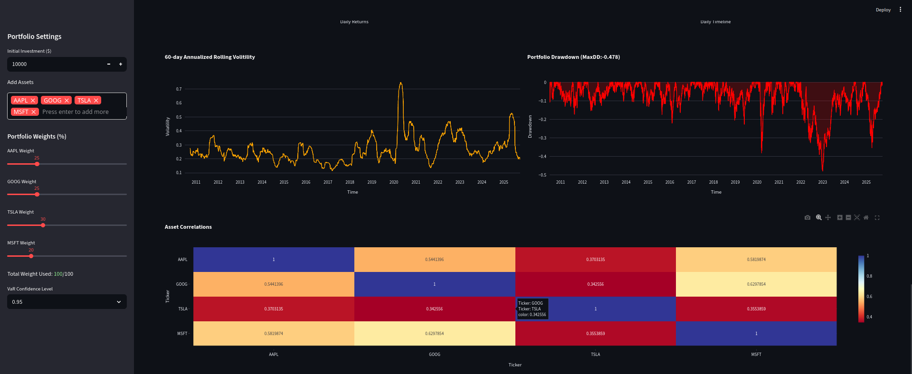

# Portfolio Risk Dashboard

## Overview

The Portfolio Risk Dashboard is an interactive web-based tool built using Streamlit, enabling users to analyze and visualize portfolio risk metrics, volatility trends, and Value-at-Risk (VaR) estimates.
Users can construct portfolios, allocate custom weights, and benchmark performance against the S&P 500 (SPX).  

This project demonstrates the intersection of data science and financial risk analytics which is valuable for quantitative analysts, risk modelers, or financial data scientists.  


## Key Features

### Dynamic Portfolio Output
Add custom tickers and define allocation weights interactively.  

### Risk Metrics:
- Mean Daily Returns
- Volatility
- Sharpe Ratio (annualized)
- Maximum Drawdown

### Value-at-Risk (VaR) Suite
- Historical VaR
- Conditional VaR
- Parametric VaR

### Comparison Analysis
Benchmark the portfolio with the S&P 500 (^GSPC) with normalized cumulative returns and difference area plots.

### Interactive Visuals
Providing a visual overview to understand the plots better.

### Custom Date Rage Filtering
Analyze using a specific historical time windows.

## Preview
### 1. Main Dashboard


### 2. Portfolio Risk Metrics


### 3. Charts from Main Dashboard


### 4. Charts from Portfolio vs S&P 500 (Second Tab)


## Tech Stacks
| Layer                    | Tools / Libraries                                        |
| :----------------------- | :------------------------------------------------------- |
| **Frontend**             | Streamlit, Plotly                                        |
| **Backend / Analytics**  | Pandas, NumPy                                            |
| **Visualization**        | Matplotlib, Plotly Express, Plotly Graph Objects         |
| **Data Source**          | `yfinance` or other market data API via `fetch_prices()` |
| **Supporting Utilities** | Custom modules (`src.data_fetch`, `src.metrics`)         |


## Project Structure
```bash
portfolio-risk-dashboard/
│
├── src/
│   ├── data_fetch.py          # Data loading and cleaning
│   ├── metrics.py             # Financial & risk computation functions
│
├── app.py                     # Main Streamlit application
├── requirements.txt           # Python dependencies
├── README.md                  # Project documentation
└── assets/                    # Content for README placeholders
```

## 🧠 Concepts Demonstrated
- Portfolio optimization and performance measurement
- Risk assessment through VaR / CVaR / drawdown analysis
- Sharpe ratio & volatility tracking
- Rolling window volatility estimation
- Time-series data manipulation using pandas MultiIndex
- Comparative benchmarking against market indices

## Included Charts
- 📈 Portfolio Cumulative Returns
- 📉 Drawdown Curve
- 📊 Return Distribution with VaR & CVaR markers
- 🧩 Asset Correlation Heatmap
- 🔄 Rolling Volatility Chart
- ⚖️ Portfolio vs S&P Performance Overlay

# Instructions: How to run
## 1. Close this repository
```bash
git clone https://github.com/alanraju/portfolio-risk-dashboard.git
cd portfolio-risk-dashboard
```

## 2. Install Dependencies
```bash
pip install -r requirements.txt
```

## 3. Run the dashboard
```bash
streamlit run app.py
```

# Future Enhancements
- ✅ Integration of Monte Carlo Simulation for risk forecasting
- ✅ Portfolio optimization using Mean-Variance (Markowitz) model
- ✅ Incorporate Sharpe, Sortino, and Calmar ratios dynamically
- ✅ Add sector & asset-class diversification charts
- ✅ Better portfolio comparison logic

*With luv from a Risk Enthusiast <3*
